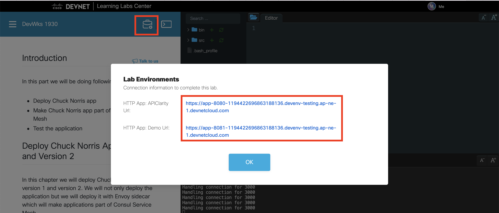

## Introduction
In this part you will be doing following tasks:
- Install Consul in recommended minimal configuration - Consul, Prometheus and Consul Ingress
- Install Grafana
- Validate your Consul and Grafana

## Before we start
Create Caddy configuration:
```bash
cat > Caddyfile <<EOF
:8080 {

    @8500 {
        path /*
    }

    reverse_proxy @8500 127.0.0.1:8500


}

:8081 {

    @3000 {
        path /*
    }

    reverse_proxy @3000 127.0.0.1:3000


}
EOF
```

Clone workshop Git repository:
```bash
cd /root
git clone https://github.com/natilik/CLEU2023-DEVWKS-2001.git
```

## Install Consul
To customize your deployment, you can pass a *yaml* file to be used during the deployment; it will override the Helm chart's default values. The chart comes with reasonable defaults, however, you will override a few values to integrate more easily with `kind` and enable useful features.

Create a custom values file called `helm-consul-values.yaml` with the following contents. This configuration will:
- Set the prefix used for all resources in the Helm chart to `consul`
- Name the Consul datacenter `dc1`
- Enable `metrics` so Envoy sidecar will be providing application metrics to Prometheus
- Configure the datacenter to run only 1 server - for our demo this is fully sufficient
- Enable the Consul UI and expose it via a `NodePort`
- Enable `metrics` in Consul UI to visualize Consul agent metrics in your Consul dashboard
- Enable Consul service mesh features by setting `connectInject.enabled` to true
- Enable Consul service mesh CRDs by setting `controller.enabled` to true
- Enable Prometheus to deploy Prometheus instance by Consul - in production you would probably use your centralized Prometheus but for this demo let’s leave Helm to create Prometheus for us
- Enable `ingressGateways` which enable Consul Ingress for our cluster with one replica which is fully sufficient for our demo environment. More on Ingress in one of the chapters.
- We will name Ingress `ingress-demo`

```bash
cat > helm-consul-values.yaml <<EOF
global:
  name: consul
  datacenter: dc1
  metrics:
    enabled: true
    enableAgentMetrics: true
    agentMetricsRetentionTime: "1m"
server:
  replicas: 1
ui:
  enabled: true
  service:
    type: 'NodePort'
  metrics:
    enabled: true
    provider: "prometheus"
    baseURL: http://prometheus-server.consul.svc.cluster.local
connectInject:
  enabled: true
controller:
  enabled: true
prometheus:
 enabled: true
ingressGateways:
  enabled: true
  defaults:
    replicas: 1
  gateways:
    - name: ingress-demo
EOF
```

You can now add official Consul Helm chart:
```bash
helm repo add hashicorp https://helm.releases.hashicorp.com
```

Now you can deploy Consul in your Kubernetes cluster using Helm:
```bash
helm install --values helm-consul-values.yaml consul hashicorp/consul --create-namespace --namespace consul
```

You can check the progress with the command:
```bash
kubectl get pods --all-namespaces -w
```

After Consul is deployed we will go to do the next steps.

## Install Grafana
We have deployed Consul with Prometheus and we are now collecting the data in Prometheus. We will install Grafana to visualize the data from Prometheus. Let’s install Grafana Helm repo first:
```bash
helm repo add grafana https://grafana.github.io/helm-charts
```

To install Grafana we will use Helm values from this file:
```bash
cat /root/CLEU2023-DEVWKS-2001/deploy/grafana/values.yaml
```

```yaml
adminPassword: password

datasources:
  datasources.yaml:
    apiVersion: 1
    datasources:
    - name: Prometheus
      type: prometheus
      url: http://prometheus-server.consul.svc
      access: proxy
      isDefault: true

dashboardProviders:
 dashboardproviders.yaml:
   apiVersion: 1
   providers:
   - name: 'default'
     orgId: 1
     folder: ''
     type: file
     disableDeletion: false
     editable: true
     options:
       path: /var/lib/grafana/dashboards/default

dashboards:
  default:
    app:
      json: |
{
  "annotations": {
    "list": [
```

Let's install Grafana with Helm:
```bash
helm install grafana grafana/grafana -f /root/CLEU2023-DEVWKS-2001/deploy/grafana/values.yaml
```

You can check the progress with the command:
```bash
kubectl get pods --all-namespaces -w
```

## Validate Consul and Grafana
Before we will validate Consul and Grafana let's make sure Caddy is running.
```bash
cd /home/developer/src
caddy stop
caddy run
```

We will be accessing Consul and Grafana via proxy. You will be able to access both services via these two links:



Verify Consul was deployed properly by accessing the Consul UI. Expose the Consul UI with `kubectl port-forward` with the `consul-server-0` pod name as the target. Open new terminal tab and run:
```bash
kubectl port-forward consul-server-0 --namespace consul 8500:8500
```

Visit the Consul Dashboard via the first link. Link should be something like this: `https://app-8080-xxxx.devenv-testing.ap-ne-1.devnetcloud.com`. You will observe a list of Consul's services, nodes, and other resources. Currently, you should only see two services: `consul` and `ingress-demo`.

Now let’s verify if Grafana was deployed by accessing Grafana Dashboard. Expose Grafana with `kubectl port-forward` with the `grafana` service name as the target. Open new terminal tab and run:
```bash
kubectl port-forward service/grafana 3000:80
```

Visit the Consul Dashboard via first link. Link should be something like this: `https://app-8081-xxxx.devenv-testing.ap-ne-1.devnetcloud.com`. Open Grafana dashboard called Applications. We don't have any application installed yet so it doesn’t contain too much of the data but we will change it the next part.
