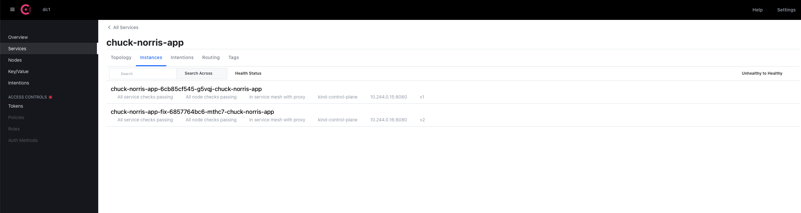

## Introduction
In this part we will be doing following tasks:
- Deploy Chuck Norris Application
- Make Chuck Norris Application is part of Consul Service Mesh
- Test Chuck Norris Application

## Deploy Chuck Norris App Version 1 and Version 2
In this chapter we will deploy Chuck Norris Application version 1 and version 2. We will not only deploy the application but we will deploy it with Envoy sidecar which will make our application part of Consul Service Mesh.

Envoy is a high-performance proxy to mediate all inbound and outbound traffic for all services in the service mesh. Envoy proxies are the only Consul components that interact with data plane traffic. This sidecar deployment allows Consul to enforce policy decisions and extract rich telemetry which can be sent to monitoring systems to provide information about the behaviour of the entire mesh.

We will deploy two version of application - `v1` and `v2`. We will want to move our end users from version 1 to version 2 gradually in case we will see any anomalies we can start rolling back to version 1 without too much of the impact.

Let’s start with creating standard Kubernetes manifest which will contain few specific attributes:
- Annotation `consul.hashicorp.com/connect-inject` ensure that Envoy sidecar will be deployed in this pod so the deployment will be part of Consul Service Mesh.
- Annotation `consul.hashicorp.com/service-meta-version` defines service meta version which will be used to identify the version of our application. More on this later on.
- Annotation `consul.hashicorp.com/service-tags` helps visually tag the service so in Consul UI we can see this as tag.
- `ServiceAccount` defines what Consul service will be attached to this deployment. In this case only one `ServiceAccount` will be created however if for example the deployment will needs to be accessed from multiple different ports each port has to be represented by `ServiceAccount`

Manifest to deploy Chuck Norris App version 1:
```bash
cat > chuck-norris-app-v1.yaml <<EOF
apiVersion: v1
kind: ServiceAccount
metadata:
  name: chuck-norris-app
---
apiVersion: apps/v1
kind: Deployment
metadata:
  labels:
    app: chuck-norris-app
    version: v1
  name: chuck-norris-app-v1
spec:
  replicas: 1
  selector:
    matchLabels:
      app: chuck-norris-app
      version: v1
  template:
    metadata:
      annotations:
        consul.hashicorp.com/connect-inject: 'true'
        consul.hashicorp.com/service-meta-version: v1
        consul.hashicorp.com/service-tags: v1
      labels:
        app: chuck-norris-app
        version: v1
    spec:
      containers:
      - image: maty0609/clus2022-chuck-app:v1
        name: chuck-norris-app-v1
        imagePullPolicy: Always
        ports:
        - containerPort: 8080
          name: http
      restartPolicy: Always
      serviceAccountName: chuck-norris-app
EOF
```

Manifest to deploy Chuck Norris App version 2:
```bash
cat > chuck-norris-app-v2.yaml <<EOF
apiVersion: apps/v1
kind: Deployment
metadata:
  labels:
    app: chuck-norris-app
    version: v2
  name: chuck-norris-app-v2
spec:
  replicas: 1
  selector:
    matchLabels:
      app: chuck-norris-app
      version: v2
  template:
    metadata:
      annotations:
        consul.hashicorp.com/connect-inject: 'true'
        consul.hashicorp.com/service-meta-version: v2
        consul.hashicorp.com/service-tags: v2
      labels:
        app: chuck-norris-app
        version: v2
    spec:
      containers:
      - image: maty0609/clus2022-chuck-app:v2
        name: chuck-norris-app-v2
        imagePullPolicy: Always
        ports:
        - containerPort: 8080
          name: http
      restartPolicy: Always
      serviceAccountName: chuck-norris-app
EOF
```

The last one we will create is the service object which will be shared between both deployments:
```bash
cat > chuck-norris-app-service.yaml <<EOF
apiVersion: v1
kind: Service
metadata:
  name: chuck-norris-app
spec:
  ports:
  - port: 8080
    targetPort: 8080
  selector:
    app: chuck-norris-app
EOF
```

Now we will apply all manifest which will start deploying both version of the application:
```bash
kubectl apply -f chuck-norris-app-v1.yaml
kubectl apply -f chuck-norris-app-v2.yaml
kubectl apply -f chuck-norris-app-service.yaml
```

You can check the progress with the command:
```bash
kubectl get pods --all-namespaces
```

You should see this:
```
NAMESPACE            NAME                                           READY   STATUS    RESTARTS   AGE
consul               consul-client-qtnfh                            1/1     Running   0          17m
consul               consul-connect-injector-5cbccb556f-sfr7b       1/1     Running   0          17m
consul               consul-connect-injector-5cbccb556f-shmgj       1/1     Running   0          17m
consul               consul-controller-6564fc54b-z42lh              1/1     Running   0          17m
consul               consul-ingress-demo-6d5d6c8bfc-tnsg6           2/2     Running   0          17m
consul               consul-server-0                                1/1     Running   0          17m
consul               consul-webhook-cert-manager-59546c4b99-t8hsw   1/1     Running   0          17m
consul               prometheus-server-86f7fbf8fd-fqshl             2/2     Running   0          17m
default              chuck-norris-app-v1-5c48745d67-x6x5x           2/2     Running   0          27s
default              chuck-norris-app-v2-78ccc86b66-264zc           2/2     Running   0          27s
default              grafana-559dbc759c-m6rgb                       1/1     Running   0          13m
kube-system          coredns-64897985d-f7kg8                        1/1     Running   0          19m
kube-system          coredns-64897985d-zngwh                        1/1     Running   0          19m
kube-system          etcd-kind-control-plane                        1/1     Running   0          19m
kube-system          kindnet-tct5z                                  1/1     Running   0          19m
kube-system          kube-apiserver-kind-control-plane              1/1     Running   0          19m
kube-system          kube-controller-manager-kind-control-plane     1/1     Running   0          19m
kube-system          kube-proxy-47hkt                               1/1     Running   0          19m
kube-system          kube-scheduler-kind-control-plane              1/1     Running   0          19m
local-path-storage   local-path-provisioner-5ddd94ff66-82wn7        1/1     Running   0          19m
```

You can see that each pod of Chuck Norris App has two containers. You can check what containers are running within the pod with command:
```bash
kubectl describe pod <name of pod>
```

You can see that pod has two containers: `chuck-norris-app` which represents our application and `envoy-sidecar` which represents Consul and makes our application part of Consul service mesh.

Go back to Consul dashboard and you can see that we have one new service called `chuck-norris-app`. If you click on `chuck-norris-app` service and click on Instances you should see both versions of our app and each instance has different tag: `v1` and `v2`.



## Test apps
Now let’s verify Chuck Norris App was deployed properly. Expose the Chuck Norris App with `kubectl port-forward` and `chuck-norris-app` deployment name as the target:
```bash
kubectl port-forward service/chuck-norris-app 8082:8080
```

Open new terminal tab and run `curl` to test Chuck Norris App and what version we currently use:
```bash
curl http://localhost:8082
```

You should see HTML code of our running app.

Let's do `curl` once again and `grep` Chuck Norris Application version in the loop:
```bash
for ((i=0; i<=100; i++)); do
  curl -v --silent http://localhost:8082 2>&1 | grep Version
done
```

Close the loop with Ctrl+C if you need to.

Service `chuck-norris-app` has a single selector `app: chuck-norris-app`. Since both of our deployments has the selector `app: chuck-norris-app` it randomly chooses either of `chuck-norris-app` deployments - version 1 or version 2. You can add selector `version: v1` or `version: v2` to start propagating version 1 or 2 application. This is however not solving what we are trying to achieve. Kubernetes itself is not able to load balance and gradually migrate to the new version of the application. For this we will need Consul Service Mesh which is able to manage the traffic and redirect it based on defined policies. Let’s move into it now.
